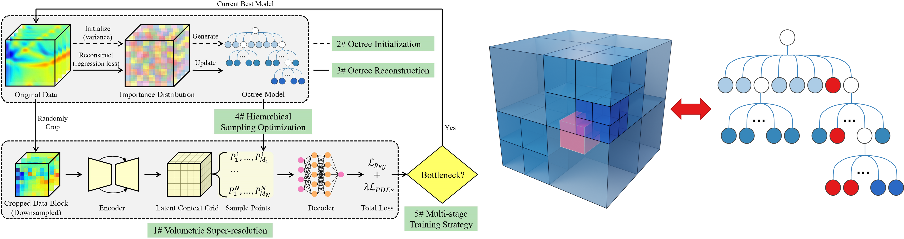
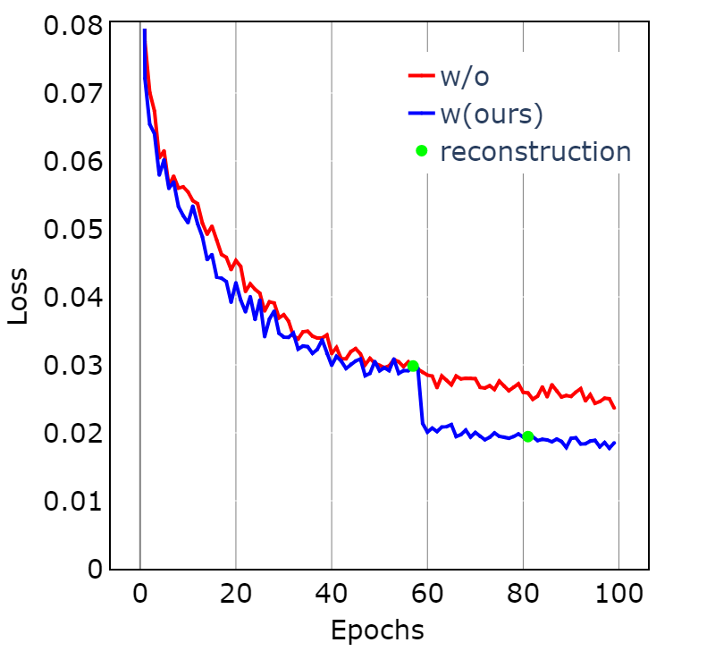

# Octree-based hierarchical sampling optimization for the volumetric super-resolution of scientific data

This is the code repository for the octree-based sampling optimization. It is proposed for efficient training of physics-constrained deep learning models. We use MeshfreeFlowNet as the baseline, which is a physical constrained space-time super-resolution framework. 

The code repository of MeshfreeFlowNet is https://github.com/maxjiang93/space_time_pde.

### Overview and Sampling Strategy



### Convergence Curve



### Dependencies and Installation

- Pytorch == 1.12.1
- CUDA == 11.7
- Other required packages in `environment.yaml`

```
cd octree-based_sampling

# Create a conda environment and activate it
conda env create --file environment.yaml
conda activate octree
```

### Running Examples

#### Train

```
python train_octree.py --slope_num=NUM --recon_min=NUM --log_dir=PATH --train_data=DATA_NAME
```

#### Test

```
python evaluation.py --ckpt=CHECKPOINT_PATH --save_path=PATH  --eval_dataset=DATA_NAME
```


#### 
