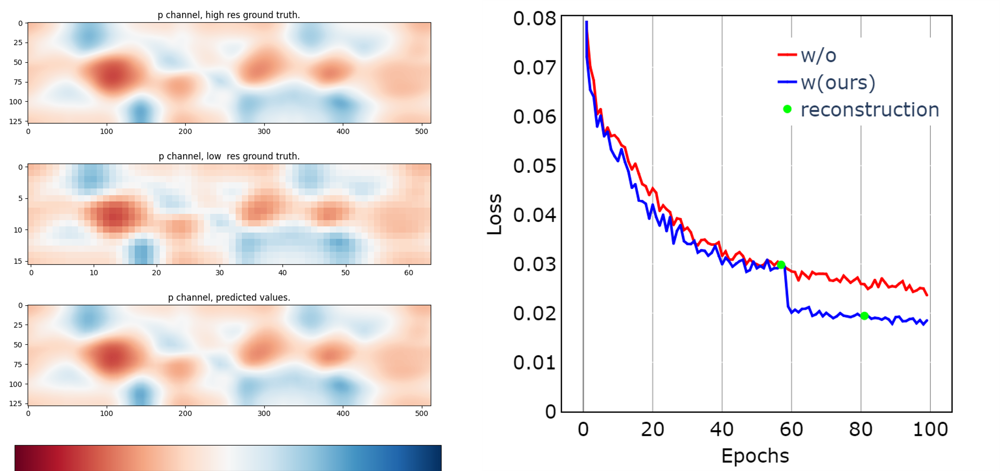

# Octree-based hierarchical sampling optimization for the volumetric super-resolution of scientific data

[Preprint version of our paper](https://arxiv.org/abs/2306.05133)

Our paper has been accepted for publication in Journal of Computational Physics.

This is the code repository of our octree-based sampling optimization. This importance sampling method is proposed for efficient training of physics-constrained deep learning models. We use MeshfreeFlowNet as the baseline, which is a physical constrained space-time super-resolution framework. 

The code repository of MeshfreeFlowNet is [here](https://github.com/maxjiang93/space_time_pde).

### Overview and Sampling Strategy


### Comparison of Convergence Curves



### Dependencies and Installation

- Pytorch == 1.12.1
- CUDA == 11.7
- Other required packages in `environment.yaml`

```
cd octree-based_sampling

# Create a conda environment and activate it
conda env create --file environment.yaml
conda activate octree
```

### Running Examples

#### Train

```
cd demo
python train_octree.py --slope_num=NUM --recon_min=NUM --log_dir=PATH --train_data=DATA_NAME
```

#### Test

If an OutOfMemoryError occurs, please reduce the value of `--eval_pseudo_batch_size`.

```
python evaluation.py --ckpt=CHECKPOINT_PATH --save_path=PATH  --eval_dataset=DATA_NAME
```


#### 
